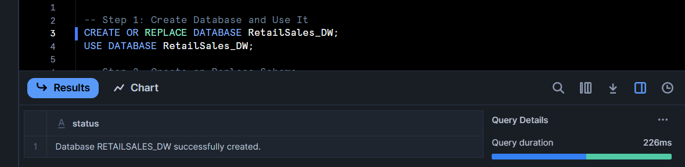
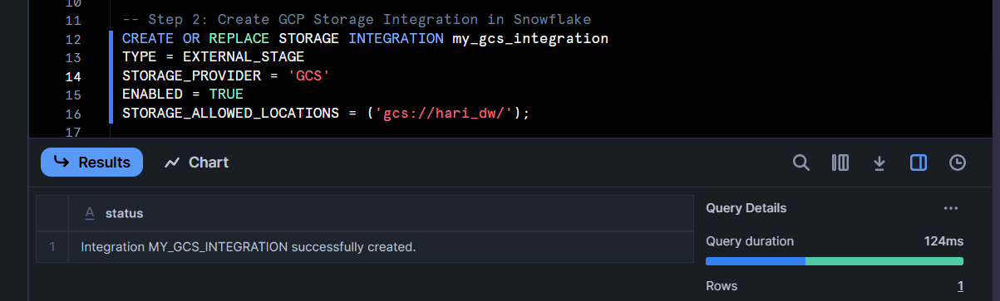
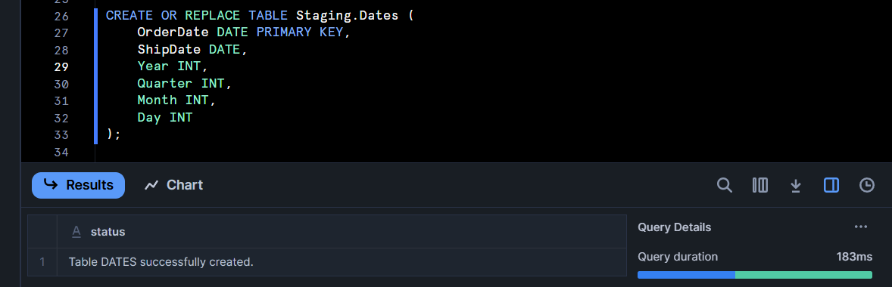
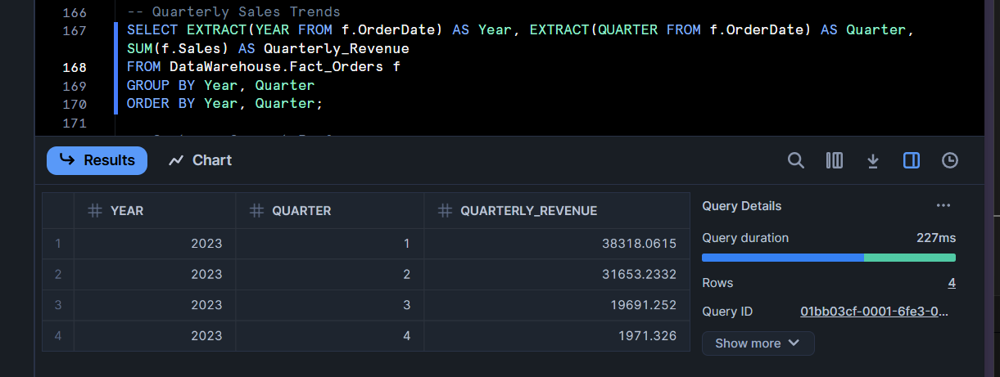
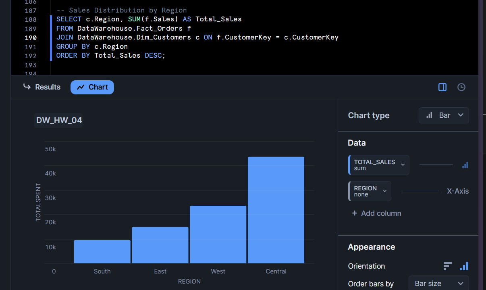

**Retail Sales Data Warehouse**

**Project Overview:**

This project builds a Sales Data Warehouse to efficiently store, manage, and analyze retail sales transactions. The ETL pipeline extracts data from raw sources, transforms it into a structured format, and loads it into a star-schema-based dimensional model. The system enables fast business insights through structured querying.


**Key Features:**

- **Data Warehouse Implementation**: Uses Snowflake to store structured data.
- **ETL Pipeline**: Extract, Transform, Load (ETL) process to clean and format data.
- **Dimensional Modeling**: Star schema with fact and dimension tables for optimized querying.
- **Data Processing**: Structured SQL queries to manage and retrieve sales data efficiently.


**Project Structure:**

```
RetailSales_DW/
│── Code/             -- Contains SQL scripts for execution   
│── Datasets/         -- Contains the datasets                
│── Screenshots/      -- Proof of successful execution                                    
│── Readme.md         -- Explanation of the project
│── Report.pdf        -- Comprehensive report on the project with results
```

**Prerequisites:**

Before running this project, ensure you have the following:

- **Database**: Snowflake
- **Cloud Storage**: Google Cloud Storage (GCS) (For loading raw data)
- **SQL Client**: SnowSQL 
- **Data Files**: CSV files for Products, Customers, Dates, and Orders


**Execution Process: Running the Retail Sales Data Warehouse in Snowflake**

### Step 1: Accessing Snowflake
- Open Snowflake Website.
- Enter your Account Details.
- Select the appropriate Role (e.g., ACCOUNTADMIN or SYSADMIN).
- Login to Snowflake.

**Create a New SQL Worksheet:**
- Select "Worksheets" in the left navigation panel.
- Click "Create" → "SQL Worksheet".

### Step 2: Set Up the Data Warehouse

Run the following script in your Snowflake Worksheet to create the database and schemas:

```sql
CREATE OR REPLACE DATABASE RetailSales_DW;
USE DATABASE RetailSales_DW;

CREATE OR REPLACE SCHEMA Staging;
CREATE OR REPLACE SCHEMA DataWarehouse;
```

### Step 3: Create GCP Storage Integration in Snowflake

```sql
CREATE OR REPLACE STORAGE INTEGRATION my_gcs_integration
TYPE = EXTERNAL_STAGE
STORAGE_PROVIDER = 'GCS'
ENABLED = TRUE
STORAGE_ALLOWED_LOCATIONS = ('gcs://hari_dw/');
```

### Step 4: Create External Stage for GCS

```sql
CREATE OR REPLACE STAGE gcs_stage
URL = 'gcs://hari_dw/'
STORAGE_INTEGRATION = my_gcs_integration
FILE_FORMAT = (TYPE = CSV, SKIP_HEADER = 1, FIELD_OPTIONALLY_ENCLOSED_BY='"');
```

### Step 5: Create Staging Tables

Use the script in the "Code" folder to create and define the staging tables.

### Step 6: Load Data into Staging Tables

Run the following SQL commands to load CSV data from Google Cloud Storage:

```sql
COPY INTO Staging.Dates FROM @gcs_stage/Dates.csv FILE_FORMAT = (TYPE = CSV, SKIP_HEADER = 1, FIELD_OPTIONALLY_ENCLOSED_BY='"') ON_ERROR = CONTINUE;
COPY INTO Staging.Customers FROM @gcs_stage/Customers.csv FILE_FORMAT = (TYPE = CSV, SKIP_HEADER = 1, FIELD_OPTIONALLY_ENCLOSED_BY='"') ON_ERROR = CONTINUE;
COPY INTO Staging.Products FROM @gcs_stage/Products.csv FILE_FORMAT = (TYPE = CSV, SKIP_HEADER = 1, FIELD_OPTIONALLY_ENCLOSED_BY='"') ON_ERROR = CONTINUE;
COPY INTO Staging.Orders FROM @gcs_stage/Orders.csv FILE_FORMAT = (TYPE = CSV, SKIP_HEADER = 1, FIELD_OPTIONALLY_ENCLOSED_BY='"') ON_ERROR = CONTINUE;
```

### Step 7: Create Fact & Dimension Tables

Use the script in the "Code" folder to create and populate the Data Warehouse tables.

**URL FOR THE SNOWFLAKE WORKSHEET**

https://app.snowflake.com/fxnplix/gb22136/w9tc2p2vMwL#query

***Execute Analytical Queries***

Execute Analytical Queries at the very end of the code.


***PROOF OF EXECUTION***








***ANALYTICAL QUERIES RESULTS***:







**Conclusion:**

This Retail Sales Data Warehouse enables efficient storage and processing of sales data, allowing businesses to organize, manage, and retrieve key sales-related insights effectively.


